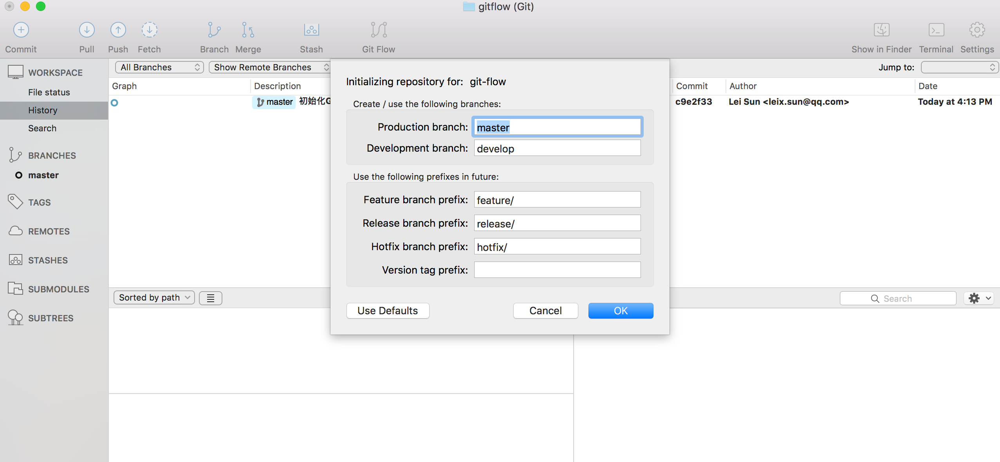
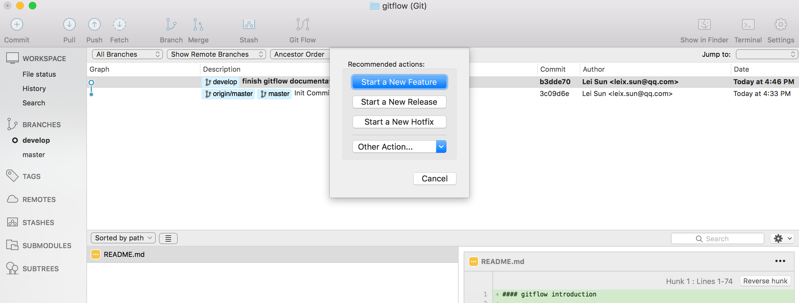
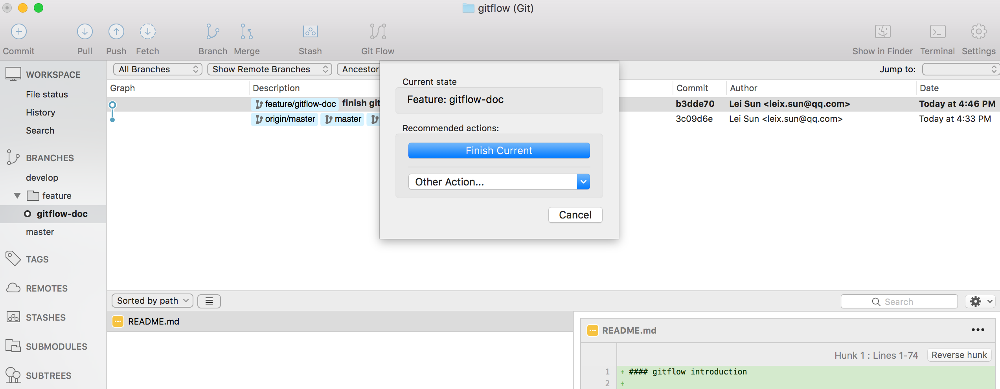

#### gitflow introduction V1.0.0

-  [A successful Git branching model](http://nvie.com/posts/a-successful-git-branching-model/)


- [comparing workflows from atlassian](https://www.atlassian.com/git/tutorials/comparing-workflows/gitflow-workflow)

#### [install git-flow command tools](https://github.com/nvie/gitflow/wiki/Installation)
-  Mac OS X

```shell
brew install git-flow
```

-  Linux  

```shell
# Ubuntu
apt-get install git-flow
# CentOS
yum install gitflow
```

-  Windows
   Follow the official guide or using GUI tools
   
#### gitflow using command line tools
   ```shell
   # init gitfflow
   git flow init
   
   # start a new feature
   git flow feature start <feature-branch-name>
   
   # publish a new feature
   git flow feature publish <feature-branch-name>
   
   # pull a new feature from remote repo
   git flow feature pull origin <feature-branch-name>
   
   # finish a new feature
   git flow feature finish <feature-branch-name>
   
   # start a new release
   git flow release start <release-branch-name>
   
   # publish a new release
   git flow release publish <release-branch-name>
   
   # finish a new release
   git flow release finish <release-branch-name>
   
   # push all tags to remote repo
   git push --tags
   
   # start a new hotfix
   git flow hotfix start <hotfix-branch-name>
   
   # finish a new hotfix
   git flow hotfix finish <hotfix-branch-name>
   ```

#### gitflow using SourceTree GUI
1. init gitflow

2. start a new feature/release/hotfix

3. finish a new feature/release/hotfix



